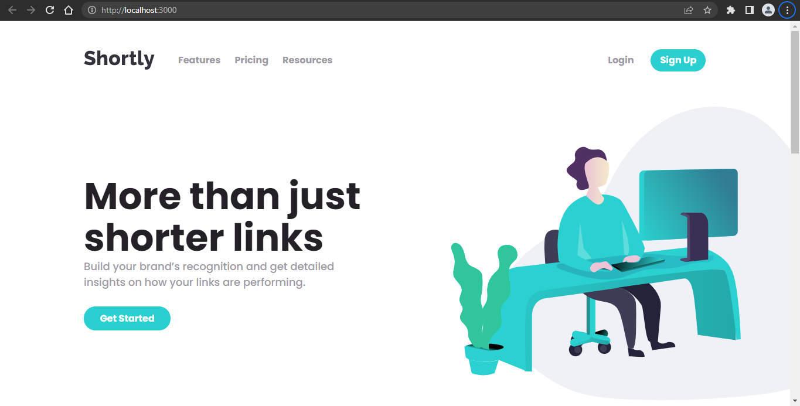
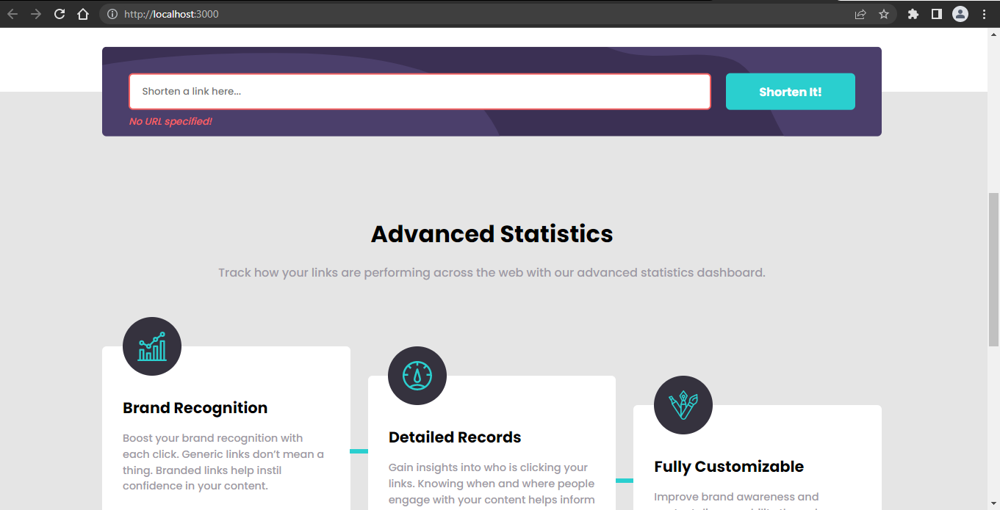

# Frontend Mentor - Shortly URL shortening API Challenge solution

This is a solution to the [Shortly URL shortening API Challenge challenge on Frontend Mentor](https://www.frontendmentor.io/challenges/url-shortening-api-landing-page-2ce3ob-G). Frontend Mentor challenges help you improve your coding skills by building realistic projects. 

## Table of contents

- [Overview](#overview)
  - [The challenge](#the-challenge)
  - [Screenshots](#screenshots)
  - [Run the Project](#run-project-in-local)
  - [Links](#links)
- [My process](#my-process)
  - [Built with](#built-with)
  - [What I learned](#what-i-learned)
  - [Useful resources](#useful-resources)
- [Author](#author)
- [Acknowledgments](#acknowledgments)

## Overview

### The challenge

Users should be able to:

- View the optimal layout for the site depending on their device's screen size
- Shorten any valid URL
- See a list of their shortened links, even after refreshing the browser
- Copy the shortened link to their clipboard in a single click
- Receive an error message when the `form` is submitted if:
  - The `input` field is empty

### Screenshots





## Run Project In Local

### `npm start`

Runs the app in the development mode.\
Open [http://localhost:3000](http://localhost:3000) to view it in your browser.

The page will reload when you make changes.\
You may also see any lint errors in the console.

## My process

### Built with

- Mobile-first workflow
- [React](https://reactjs.org/) - JS library
- SCSS - A CSS preprocessor

### What I learned

There were many things which I wanted to work on with this project. I wanted to use React with SCSS, as well as learning about web storage APIs.

Accessing local storage:

```js
window.localStorage.setItem('language', "javascript")
window.localStorage.getItem('key') //outputs javascript
```

### Useful resources

- [React](https://reactjs.org/docs/getting-started.html) - React has a beautiful documentation. This is the best place if someone is looking to get started with React.

- [Promises](https://developer.mozilla.org/en-US/docs/Learn/JavaScript/Asynchronous/Promises) - MDN is the best place to learn web development, a good resource to get started with fetch API and promises.

## Author

- Frontend Mentor - [Harsh Jain](https://www.frontendmentor.io/profile/harshj11)

## Acknowledgments

A huge shout out to mdn web docs for putting such an amazing content in a well documented manner.

A big thank you to Frontend Mentor for curating these beautiful challenges to make people learn by doing.

Until next time, Happy Coding!